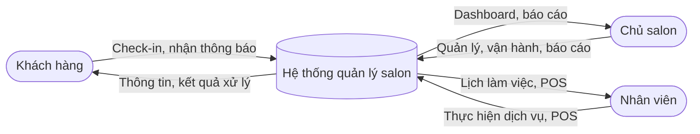

# KIẾN TRÚC VÀ THIẾT KẾ HỆ THỐNG - SAAS QUẢN LÝ SALON NAILS

## 1. KIẾN TRÚC HỆ THỐNG (Architecture)

### 1.1 Tổng quan kiến trúc
Hệ thống được thiết kế theo mô hình **3-tier Architecture** với **microservices pattern**:

```
┌─────────────────────────────────────────────────────────────┐
│                    PRESENTATION LAYER                       │
├─────────────────────────────────────────────────────────────┤
│  React Native App  │  ReactJS Dashboard  │  Admin Portal    │
│  (Customer)        │  (Salon Owner)      │  (System Admin)  │
└─────────────────────────────────────────────────────────────┘
                               │
                               ▼
┌─────────────────────────────────────────────────────────────┐
│                    API GATEWAY & LOAD BALANCER              │
├─────────────────────────────────────────────────────────────┤
│  Spring Cloud Gateway │  Nginx/HAProxy │  Rate Limiting     │
│  Authentication (JWT, RBAC)                                 │
└─────────────────────────────────────────────────────────────┘
                               │
                               ▼
┌─────────────────────────────────────────────────────────────┐
│                    BUSINESS LOGIC LAYER                     │
├─────────────────────────────────────────────────────────────┤
│  Customer Service │  POS Service  │  Review Service         │
│  Staff Service    │  Analytics Service │ Notification Service│
│  (Spring Boot Microservices)                               │
└─────────────────────────────────────────────────────────────┘
                               │
                               ▼
┌─────────────────────────────────────────────────────────────┐
│                    DATA ACCESS LAYER                        │
├─────────────────────────────────────────────────────────────┤
│  MySQL (Main DB) │  Redis (Cache/Session) │  AWS S3 (Files) │
└─────────────────────────────────────────────────────────────┘
```

### 1.2 Các thành phần chính

#### 1.2.1 Frontend Applications
- **React Native Mobile App (Expo)**: Ứng dụng check-in cho khách hàng
- **ReactJS Dashboard**: Giao diện quản lý cho chủ salon (Material-UI, Redux Toolkit)
- **Admin Portal**: Giao diện quản trị hệ thống

#### 1.2.2 Backend Microservices
- **Customer Service**: Quản lý thông tin khách hàng và check-in
- **POS Service**: Xử lý thanh toán, quản lý sản phẩm/dịch vụ
- **Review Service**: Quản lý đánh giá, phản hồi khách hàng
- **Staff Service**: Quản lý nhân viên, lịch làm việc, hoa hồng
- **Analytics Service**: Báo cáo, phân tích dữ liệu, dự đoán
- **Notification Service**: Gửi SMS, email, push notification

#### 1.2.3 Database & Storage
- **MySQL**: Database chính lưu trữ dữ liệu business
- **Redis**: Cache và session management
- **AWS S3 hoặc local storage**: Lưu trữ hình ảnh và files

#### 1.2.4 External Services
- **SMS Gateway**: Twilio/Viettel SMS
- **Email Service**: SendGrid/Mailgun
- **Social Media APIs**: Facebook, Google, Zalo
- **Payment Gateway**: Stripe, PayPal (future/optional)

### 1.3 Đặc điểm kiến trúc

#### 1.3.1 Scalability (Khả năng mở rộng)
- **Horizontal Scaling**: Có thể thêm instances cho từng service
- **Load Balancing**: Phân tải request giữa các servers
- **Database Sharding**: Phân chia data theo salon_id

#### 1.3.2 Reliability (Độ tin cậy)
- **Circuit Breaker Pattern**: Tránh cascade failures
- **Retry Mechanism**: Tự động retry khi có lỗi
- **Health Checks**: Monitoring service health

#### 1.3.3 Security (Bảo mật)
- **JWT Authentication**: Xác thực người dùng
- **API Rate Limiting**: Chống spam và DDoS
- **Data Encryption**: Mã hóa dữ liệu nhạy cảm
- **HTTPS/TLS**: Bảo mật truyền tải

### 1.4 Technology Stack

#### 1.4.1 Frontend
- **React Native (Expo)**: Cross-platform mobile app
- **ReactJS + Material-UI**: Web dashboard
- **TypeScript**: Type safety
- **Redux Toolkit**: State management

#### 1.4.2 Backend
- **Spring Boot**: Java-based REST APIs, microservices
- **Spring Cloud Gateway**: API Gateway
- **Spring Security + JWT**: Authentication & RBAC
- **Redis**: Caching and session management
- **MySQL**: Primary database

#### 1.4.3 DevOps & Infrastructure
- **Docker, Docker Compose, Kubernetes**: Containerization & orchestration
- **Nginx/HAProxy**: Reverse proxy, load balancing
- **AWS, DigitalOcean, hoặc server riêng**: Cloud hosting
- **CI/CD**: GitHub Actions hoặc Jenkins
- **Monitoring**: Prometheus, Grafana, ELK Stack (Elasticsearch, Logstash, Kibana)
#### 1.4.4 Security & Compliance
- **JWT Authentication, Refresh Token**
- **Role-based Access Control (RBAC)**
- **Data Encryption (AES-256 cho dữ liệu nhạy cảm)**
- **API Security: Rate limiting, CORS, input validation**
- **GDPR Compliance: Data anonymization, right to delete**

## 2. LUỒNG DỮ LIỆU (Data Flow Diagram)


### 2.1 Data Flow Diagram Level 0 (Context Diagram) - Mermaid



### 2.2 Data Flow Diagram Level 1 - Mermaid

```mermaid
flowchart TD
    KHACH_HANG1([Khách hàng])
    CHU_SALON1([Chủ salon])
    NHAN_VIEN1([Nhân viên])

    CHECKIN([1. Check-in System])

    QUANLY([2. Quản lý khách hàng])
    POS([3. Hệ thống POS])
    CAMPAIGN([4. Hệ thống chiến dịch & khuyến mãi])
    REPORT([5. Báo cáo & phân tích])

    CUSTOMER_DB[(Kho dữ liệu khách hàng)]
    TRANSACTION_DB[(Kho dữ liệu giao dịch)]
    REVIEW_DB[(Kho dữ liệu đánh giá)]
    STAFF_DB[(Kho dữ liệu nhân viên)]
    CAMPAIGN_DB[(Kho dữ liệu chiến dịch)]

    %% Request từ đối tượng đến hệ thống
    KHACH_HANG1 -- "Yêu cầu check-in, xem điểm, nhận ưu đãi" --> CHECKIN
    CHU_SALON1 -- "Quản lý khách, tạo chiến dịch, xem báo cáo" --> QUANLY
    NHAN_VIEN1 -- "Thực hiện POS, cập nhật dịch vụ" --> POS

    %% Response từ hệ thống về đối tượng
    CHECKIN -- "Kết quả check-in, thông báo, điểm thưởng" --> KHACH_HANG1
    QUANLY -- "Thông tin khách, trạng thái chiến dịch" --> CHU_SALON1
    POS -- "Kết quả giao dịch, hoa hồng" --> NHAN_VIEN1

    %% Luồng nội bộ hệ thống
    CHECKIN -- "Tạo chiến dịch tự động" --> CAMPAIGN
    CHECKIN -- "Cập nhật điểm, lịch sử" --> CUSTOMER_DB
    CHECKIN -- "Tạo giao dịch mới" --> TRANSACTION_DB
    CHECKIN -- "Ghi nhận đánh giá" --> REVIEW_DB

    QUANLY -- "Quản lý khách hàng" --> CUSTOMER_DB
    QUANLY -- "Quản lý nhân viên" --> STAFF_DB
    QUANLY -- "Quản lý chiến dịch" --> CAMPAIGN_DB

    POS -- "Tạo giao dịch, cập nhật doanh thu" --> TRANSACTION_DB
    POS -- "Cập nhật khách hàng" --> CUSTOMER_DB
    POS -- "Cập nhật nhân viên" --> STAFF_DB

    CAMPAIGN -- "Lưu lịch sử chiến dịch" --> CAMPAIGN_DB
    CAMPAIGN -- "Cập nhật khách hưởng ưu đãi" --> CUSTOMER_DB

    REPORT -- "Truy vấn khách hàng" --> CUSTOMER_DB
    REPORT -- "Truy vấn giao dịch" --> TRANSACTION_DB
    REPORT -- "Truy vấn đánh giá" --> REVIEW_DB
    REPORT -- "Truy vấn nhân viên" --> STAFF_DB
    REPORT -- "Truy vấn chiến dịch" --> CAMPAIGN_DB
```



**Mô tả:**
- Đã thay thế "Database System" bằng các data store thực tế: Customer, Transaction, Review, Staff, Campaign.
- "Report System" đổi thành "Reporting & Analytics" để phản ánh đúng chức năng.
- Các process kết nối trực tiếp với data store phù hợp.
- Luồng request/response và xử lý nội bộ đều rõ ràng, đúng chuẩn DFD.

**Mô tả:**
- Các mũi tên từ vai trò (khách hàng, chủ salon, nhân viên) đến hệ thống thể hiện request (yêu cầu, thao tác).
- Các mũi tên ngược lại thể hiện response (kết quả, thông tin trả về).
- Các mũi tên giữa các module hệ thống thể hiện luồng xử lý nội bộ.
- "Campaign & Promotion System" thay cho "Marketing Campaign" để đồng nhất thuật ngữ.

### 2.3 Data Flow Diagram Level 2 - Process 1: Check-in System (Mermaid)


**Mô tả các process và entity giữ nguyên như cũ, chỉ thay thế phần sơ đồ bằng Mermaid cho trực quan, hiện đại và dễ chỉnh sửa.**

## 3. SƠ ĐỒ THỰC THỂ LIÊN KẾT (Entity Relationship Diagram)

### 3.1 Main Entities

```
┌─────────────────┐     ┌─────────────────┐     ┌─────────────────┐
│     SALON       │     │    CUSTOMER     │     │     STAFF       │
├─────────────────┤     ├─────────────────┤     ├─────────────────┤
│ + salon_id (PK) │     │ + customer_id   │     │ + staff_id (PK) │
│ + name          │     │ + phone_number  │     │ + salon_id (FK) │
│ + address       │     │ + full_name     │     │ + username      │
│ + phone         │     │ + email         │     │ + password      │
│ + email         │     │ + birthday      │     │ + full_name     │
│ + owner_name    │     │ + gender        │     │ + role          │
│ + created_at    │     │ + customer_type │     │ + commission_rate│
│ + updated_at    │     │ + total_visits  │     │ + created_at    │
└─────────────────┘     │ + total_spent   │     │ + updated_at    │
                        │ + loyalty_points│     └─────────────────┘
                        │ + last_visit    │
                        │ + created_at    │
                        │ + updated_at    │
                        └─────────────────┘
```

### 3.2 Relationship Diagram

```
     SALON                    CUSTOMER
┌─────────────┐            ┌─────────────┐
│ salon_id    │            │ customer_id │
│ name        │            │ phone       │
│ address     │            │ full_name   │
│ phone       │            │ email       │
│ email       │            │ birthday    │
│ owner_name  │            │ type        │
└─────────────┘            └─────────────┘
       │                          │
       │ 1                        │
       │                          │ M
       │                          │
       ▼                          ▼
┌─────────────┐            ┌─────────────┐
│   STAFF     │            │   VISIT     │
│ staff_id    │            │ visit_id    │
│ salon_id    │            │ customer_id │
│ username    │            │ salon_id    │
│ full_name   │            │ staff_id    │
│ role        │            │ visit_date  │
│ commission  │            │ services    │
└─────────────┘            │ total_amount│
       │                   │ status      │
       │ 1                 └─────────────┘
       │                          │
       │ M                        │ M
       │                          │
       ▼                          ▼
┌─────────────┐            ┌─────────────┐
│   ORDER     │            │  SERVICE    │
│ order_id    │            │ service_id  │
│ customer_id │            │ salon_id    │
│ staff_id    │            │ name        │
│ total_amount│            │ price       │
│ commission  │            │ duration    │
│ created_at  │            │ description │
└─────────────┘            └─────────────┘
       │                          │
       │ 1                        │
       │                          │ M
       │ M                        │
       ▼                          ▼
┌─────────────┐            ┌─────────────┐
│ORDER_DETAIL │            │   PRODUCT   │
│ detail_id   │            │ product_id  │
│ order_id    │            │ salon_id    │
│ service_id  │            │ name        │
│ product_id  │            │ price       │
│ quantity    │            │ stock       │
│ unit_price  │            │ category    │
│ total_price │            └─────────────┘
└─────────────┘
```

### 3.3 Additional Entities

```
┌─────────────────┐     ┌─────────────────┐     ┌─────────────────┐
│    CAMPAIGN     │     │   APPOINTMENT   │     │   NOTIFICATION  │
├─────────────────┤     ├─────────────────┤     ├─────────────────┤
│ + campaign_id   │     │ + appointment_id│     │ + notification_id│
│ + salon_id      │     │ + customer_id   │     │ + customer_id   │
│ + name          │     │ + staff_id      │     │ + type          │
│ + type          │     │ + salon_id      │     │ + title         │
│ + target_group  │     │ + service_id    │     │ + content       │
│ + discount_type │     │ + appointment_dt│     │ + status        │
│ + discount_value│     │ + duration      │     │ + sent_at       │
│ + start_date    │     │ + status        │     │ + created_at    │
│ + end_date      │     │ + notes         │     └─────────────────┘
│ + status        │     │ + created_at    │
│ + created_at    │     │ + updated_at    │
└─────────────────┘     └─────────────────┘
```

---

*Tài liệu kiến trúc này sẽ được cập nhật khi có thay đổi trong quá trình phát triển.*
