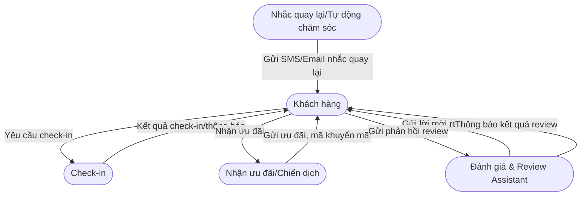
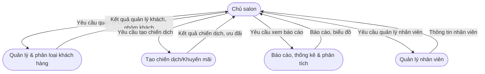
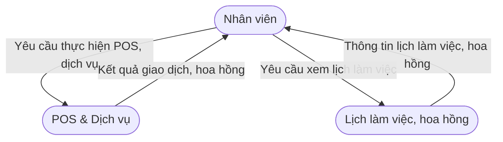
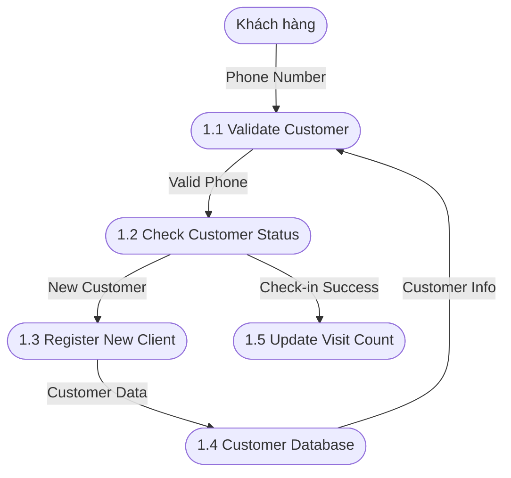

# KIẾN TRÚC VÀ THIẾT KẾ HỆ THỐNG - SAAS QUẢN LÝ SALON NAILS

## 1. KIẾN TRÚC HỆ THỐNG (Architecture)

### 1.1 Tổng quan kiến trúc
Hệ thống được thiết kế theo mô hình **3-tier Architecture** với **microservices pattern**:

```
┌─────────────────────────────────────────────────────────────┐
│                    PRESENTATION LAYER                       │
├─────────────────────────────────────────────────────────────┤
│  React Native App  │  ReactJS Dashboard  │  Admin Portal    │
│  (Customer)        │  (Salon Owner)      │  (System Admin)  │
└─────────────────────────────────────────────────────────────┘
                               │
                               ▼
┌─────────────────────────────────────────────────────────────┐
│                    API GATEWAY & LOAD BALANCER              │
├─────────────────────────────────────────────────────────────┤
│  Spring Cloud Gateway │  Nginx/HAProxy │  Rate Limiting     │
│  Authentication (JWT, RBAC)                                 │
└─────────────────────────────────────────────────────────────┘
                               │
                               ▼
┌─────────────────────────────────────────────────────────────┐
│                    BUSINESS LOGIC LAYER                     │
├─────────────────────────────────────────────────────────────┤
│  Customer Service │  POS Service  │  Review Service         │
│  Staff Service    │  Analytics Service │ Notification Service│
│  (Spring Boot Microservices)                               │
└─────────────────────────────────────────────────────────────┘
                               │
                               ▼
┌─────────────────────────────────────────────────────────────┐
│                    DATA ACCESS LAYER                        │
├─────────────────────────────────────────────────────────────┤
│  MySQL (Main DB) │  Redis (Cache/Session) │  AWS S3 (Files) │
└─────────────────────────────────────────────────────────────┘
```

### 1.2 Các thành phần chính

#### 1.2.1 Frontend Applications
- **React Native Mobile App (Expo)**: Ứng dụng check-in cho khách hàng
- **ReactJS Dashboard**: Giao diện quản lý cho chủ salon (Material-UI, Redux Toolkit)
- **Admin Portal**: Giao diện quản trị hệ thống

#### 1.2.2 Backend Microservices
- **Customer Service**: Quản lý thông tin khách hàng và check-in
- **POS Service**: Xử lý thanh toán, quản lý sản phẩm/dịch vụ
- **Review Service**: Quản lý đánh giá, phản hồi khách hàng
- **Staff Service**: Quản lý nhân viên, lịch làm việc, hoa hồng
- **Analytics Service**: Báo cáo, phân tích dữ liệu, dự đoán
- **Notification Service**: Gửi SMS, email, push notification

#### 1.2.3 Database & Storage
- **MySQL**: Database chính lưu trữ dữ liệu business
- **Redis**: Cache và session management
- **AWS S3 hoặc local storage**: Lưu trữ hình ảnh và files

#### 1.2.4 External Services
- **SMS Gateway**: Twilio/Viettel SMS
- **Email Service**: SendGrid/Mailgun
- **Social Media APIs**: Facebook, Google, Zalo
- **Payment Gateway**: Stripe, PayPal (future/optional)

### 1.3 Đặc điểm kiến trúc

#### 1.3.1 Scalability (Khả năng mở rộng)
- **Horizontal Scaling**: Có thể thêm instances cho từng service
- **Load Balancing**: Phân tải request giữa các servers
- **Database Sharding**: Phân chia data theo salon_id

#### 1.3.2 Reliability (Độ tin cậy)
- **Circuit Breaker Pattern**: Tránh cascade failures
- **Retry Mechanism**: Tự động retry khi có lỗi
- **Health Checks**: Monitoring service health

#### 1.3.3 Security (Bảo mật)
- **JWT Authentication**: Xác thực người dùng
- **API Rate Limiting**: Chống spam và DDoS
- **Data Encryption**: Mã hóa dữ liệu nhạy cảm
- **HTTPS/TLS**: Bảo mật truyền tải

### 1.4 Technology Stack

#### 1.4.1 Frontend
- **React Native (Expo)**: Cross-platform mobile app
- **ReactJS + Material-UI**: Web dashboard
- **TypeScript**: Type safety
- **Redux Toolkit**: State management

#### 1.4.2 Backend
- **Spring Boot**: Java-based REST APIs, microservices
- **Spring Cloud Gateway**: API Gateway
- **Spring Security + JWT**: Authentication & RBAC
- **Redis**: Caching and session management
- **MySQL**: Primary database

#### 1.4.3 DevOps & Infrastructure
- **Docker, Docker Compose, Kubernetes**: Containerization & orchestration
- **Nginx/HAProxy**: Reverse proxy, load balancing
- **AWS, DigitalOcean, hoặc server riêng**: Cloud hosting
- **CI/CD**: GitHub Actions hoặc Jenkins
- **Monitoring**: Prometheus, Grafana, ELK Stack (Elasticsearch, Logstash, Kibana)
#### 1.4.4 Security & Compliance
- **JWT Authentication, Refresh Token**
- **Role-based Access Control (RBAC)**
- **Data Encryption (AES-256 cho dữ liệu nhạy cảm)**
- **API Security: Rate limiting, CORS, input validation**
- **GDPR Compliance: Data anonymization, right to delete**

## 2. LUỒNG DỮ LIỆU (Data Flow Diagram)


### 2.1 Data Flow Diagram Level 0 (Context Diagram) - Mermaid


### 2.2 Data Flow Diagram Level 1 - Theo Actor (Mermaid)

#### 2.2.1 DFD Level 1 - Khách hàng


#### 2.2.2 DFD Level 1 - Chủ salon


#### 2.2.3 DFD Level 1 - Nhân viên


- Đã bổ sung process "Tự động marketing & nhắc khách quay lại": hệ thống tự động gửi SMS/Email sau 30/60/90 ngày nếu khách chưa quay lại, nội dung như "We miss you! Come back to us and get 10% on your Visit".
- Đã bổ sung process "Quản lý đánh giá & Review Assistant": gửi lời mời review tự động (delay sau khi check-in), nhận phản hồi review từ khách, phân biệt review tốt (gửi Google) và review xấu (lưu nội bộ, không public), không cho phép thuê người viết review.
- Các luồng dữ liệu thể hiện rõ automation marketing, review assistant, và các nghiệp vụ thực tế.
- Các mũi tên từ vai trò (khách hàng, chủ salon, nhân viên) đến hệ thống thể hiện request (yêu cầu, thao tác).
- Các mũi tên ngược lại thể hiện response (kết quả, thông tin trả về).
- Các mũi tên giữa các module hệ thống thể hiện luồng xử lý nội bộ, đúng chuẩn DFD.
- Đã mở rộng process "Quản lý & phân loại khách hàng": hệ thống tự động phân loại nhóm khách (mới, thân thiết, VIP, vắng lâu ngày).
- "Tự động chăm sóc & marketing": gửi SMS/email nhắc khách quay lại sau 60 ngày chưa check-in (kèm mã khuyến mãi), tạo chiến dịch marketing dịp đặc biệt (Noel, kỷ niệm, v.v.) gửi hàng loạt.
- "Báo cáo, thống kê & phân tích": thống kê doanh thu, dịch vụ, nhân viên; biểu đồ cột tuần/tháng về lượng khách, doanh thu, dịch vụ giúp chủ tiệm phân tích xu hướng.
- Các luồng dữ liệu thể hiện rõ automation marketing, review assistant, phân loại khách, và các nghiệp vụ thực tế.
- Các mũi tên từ vai trò (khách hàng, chủ salon, nhân viên) đến hệ thống thể hiện request (yêu cầu, thao tác).
- Các mũi tên ngược lại thể hiện response (kết quả, thông tin trả về).
- Các mũi tên giữa các module hệ thống thể hiện luồng xử lý nội bộ, đúng chuẩn DFD.
**Mô tả bổ sung:**
- Đã mở rộng process "Quản lý & phân loại khách hàng": hệ thống tự động phân loại nhóm khách (mới, thân thiết, VIP, vắng lâu ngày).
- "Tự động chăm sóc & marketing": gửi SMS/email nhắc khách quay lại sau 30/60/90 ngày chưa check-in (kèm mã khuyến mãi), tạo chiến dịch marketing dịp đặc biệt (Noel, kỷ niệm, v.v.) gửi hàng loạt.
- "Báo cáo, thống kê & phân tích": thống kê doanh thu, dịch vụ, nhân viên; biểu đồ cột tuần/tháng về lượng khách, doanh thu, dịch vụ giúp chủ tiệm phân tích xu hướng.
- Các luồng dữ liệu thể hiện rõ automation marketing, review assistant, phân loại khách, và các nghiệp vụ thực tế.
- Các mũi tên từ vai trò (khách hàng, chủ salon, nhân viên) đến hệ thống thể hiện request (yêu cầu, thao tác).
- Các mũi tên ngược lại thể hiện response (kết quả, thông tin trả về).
- Các mũi tên giữa các module hệ thống thể hiện luồng xử lý nội bộ, đúng chuẩn DFD.
- Đã mở rộng process "Quản lý & phân loại khách hàng": hệ thống tự động phân loại nhóm khách (mới, thân thiết, VIP, vắng lâu ngày).
- "Tự động chăm sóc & marketing": gửi SMS/email nhắc khách quay lại sau 60 ngày chưa check-in (kèm mã khuyến mãi), tạo chiến dịch marketing dịp đặc biệt (Noel, kỷ niệm, v.v.) gửi hàng loạt.
- "Báo cáo, thống kê & phân tích": thống kê doanh thu, dịch vụ, nhân viên; biểu đồ cột tuần/tháng về lượng khách, doanh thu, dịch vụ giúp chủ tiệm phân tích xu hướng.
- Các luồng dữ liệu thể hiện rõ automation marketing, review assistant, phân loại khách, và các nghiệp vụ thực tế.
- Các mũi tên từ vai trò (khách hàng, chủ salon, nhân viên) đến hệ thống thể hiện request (yêu cầu, thao tác).
- Các mũi tên ngược lại thể hiện response (kết quả, thông tin trả về).
- Các mũi tên giữa các module hệ thống thể hiện luồng xử lý nội bộ, đúng chuẩn DFD.
- Đã bổ sung process "Tự động marketing & nhắc khách quay lại": hệ thống tự động gửi SMS/Email sau 30/60/90 ngày nếu khách chưa quay lại, nội dung như "We miss you! Come back to us and get 10% on your Visit".
- Đã bổ sung process "Quản lý đánh giá & Review Assistant": gửi lời mời review tự động (delay sau khi check-in), nhận phản hồi review từ khách, phân biệt review tốt (gửi Google) và review xấu (lưu nội bộ, không public), không cho phép thuê người viết review.
- Các luồng dữ liệu thể hiện rõ automation marketing, review assistant, và các nghiệp vụ thực tế.
- Các mũi tên từ vai trò (khách hàng, chủ salon, nhân viên) đến hệ thống thể hiện request (yêu cầu, thao tác).
- Các mũi tên ngược lại thể hiện response (kết quả, thông tin trả về).
- Các mũi tên giữa các module hệ thống thể hiện luồng xử lý nội bộ, đúng chuẩn DFD.

### 2.3 Data Flow Diagram Level 2 - Process 1: Check-in System (Mermaid)



**Mô tả các process và entity giữ nguyên như cũ, chỉ thay thế phần sơ đồ bằng Mermaid cho trực quan, hiện đại và dễ chỉnh sửa.**


## 3. SƠ ĐỒ THỰC THỂ LIÊN KẾT (Entity Relationship Diagram)


```mermaid
erDiagram
    SALON ||--o{ CUSTOMER : "1:N"
    SALON ||--o{ STAFF : "1:N"
    SALON ||--o{ SERVICE : "1:N"
    SALON ||--o{ PRODUCT : "1:N"
    SALON ||--o{ CAMPAIGN : "1:N"

    CUSTOMER ||--o{ VISIT : "1:N"
    CUSTOMER ||--o{ ORDER : "1:N"
    CUSTOMER ||--o{ APPOINTMENT : "1:N"
    CUSTOMER ||--o{ REVIEW : "1:N"
    CUSTOMER ||--o{ NOTIFICATION : "1:N"

    STAFF ||--o{ VISIT : "1:N"
    STAFF ||--o{ ORDER : "1:N"
    STAFF ||--o{ APPOINTMENT : "1:N"

    CAMPAIGN ||--o{ APPOINTMENT : "1:N"

    %% Các mối quan hệ nhiều-nhiều (N:M) không thể hiện trực tiếp bằng Mermaid erDiagram, cần note ở dưới.

    %% Ví dụ: Một ORDER có thể chứa nhiều SERVICE/PRODUCT và ngược lại (N:M), thực tế sẽ cần bảng phụ.

    %% REVIEW chỉ liên kết với VISIT, từ đó truy ngược ra các entity khác
    VISIT ||--o{ REVIEW : "1:N"

    %% Loyalty program
    LOYALTY_PROGRAM ||--o{ CUSTOMER : "N:M" %% Một chương trình có nhiều khách, một khách có thể tham gia nhiều chương trình

    %% Promotion
    CAMPAIGN ||--o{ PROMOTION : "1:N" %% Một campaign có nhiều promotion, promotion có thể độc lập
    PROMOTION ||--o{ CUSTOMER : "N:M" %% Một promotion áp dụng cho nhiều khách, một khách nhận nhiều promotion
```

**Ghi chú về quan hệ:**

- 1:N (một-nhiều):
    - Một SALON có nhiều CUSTOMER, STAFF, SERVICE, PRODUCT, CAMPAIGN
    - Một CUSTOMER có nhiều VISIT, ORDER, APPOINTMENT, NOTIFICATION
    - Một STAFF có nhiều VISIT, ORDER, APPOINTMENT
    - Một CAMPAIGN có nhiều APPOINTMENT, nhiều PROMOTION
    - Một VISIT có nhiều REVIEW (review chỉ cần liên kết với VISIT, từ đó truy ngược ra CUSTOMER, STAFF, SALON)
    - Một LOYALTY_PROGRAM có nhiều CUSTOMER
    - Một PROMOTION có thể thuộc một CAMPAIGN
- N:M (nhiều-nhiều):
    - ORDER và SERVICE/PRODUCT là N:M (một đơn hàng có nhiều dịch vụ/sản phẩm, một dịch vụ/sản phẩm có thể thuộc nhiều đơn hàng). Thực tế sẽ cần bảng phụ (ORDER_DETAIL), nhưng ở mức khái niệm chỉ cần note.
    - LOYALTY_PROGRAM và CUSTOMER là N:M (khách có thể tham gia nhiều chương trình, chương trình có nhiều khách)
    - PROMOTION và CUSTOMER là N:M (một promotion áp dụng cho nhiều khách, một khách nhận nhiều promotion)
- 1:1 (một-một):
    - Không có mối quan hệ 1:1 rõ ràng trong nghiệp vụ chính của hệ thống này.

**Lưu ý:** Mermaid erDiagram chỉ thể hiện tốt 1:N, các quan hệ N:M nên ghi chú rõ ở dưới sơ đồ.

**Lưu ý:** Sơ đồ ERD này ở mức khái niệm, chỉ thể hiện các thực thể và mối quan hệ chính, lược bỏ các bảng chi tiết/phụ như ORDER_DETAIL để dễ nhìn và tập trung vào nghiệp vụ lõi.

**Lưu ý:** Đã bổ sung entity REVIEW (đánh giá) đúng như các process DFD, đảm bảo đầy đủ các thực thể chính và mối quan hệ nghiệp vụ.

---

*Tài liệu kiến trúc này sẽ được cập nhật khi có thay đổi trong quá trình phát triển.*
